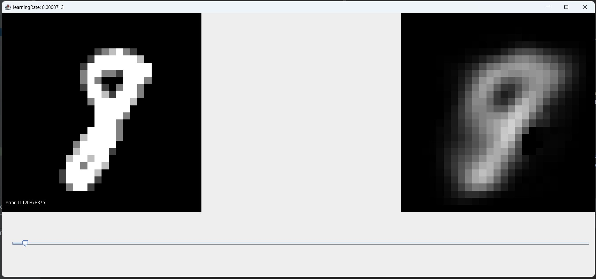
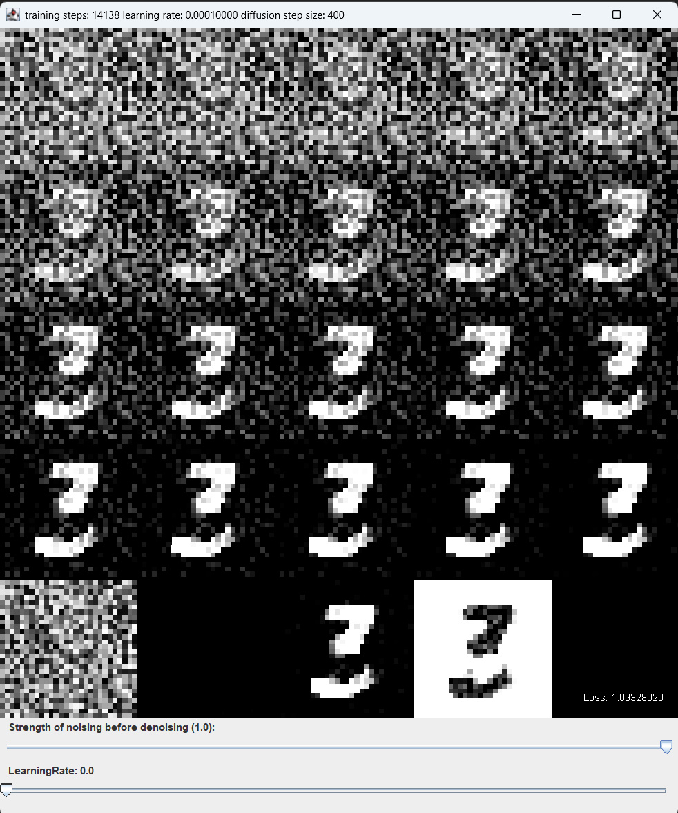
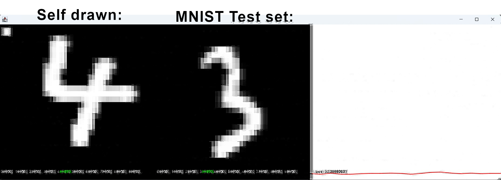
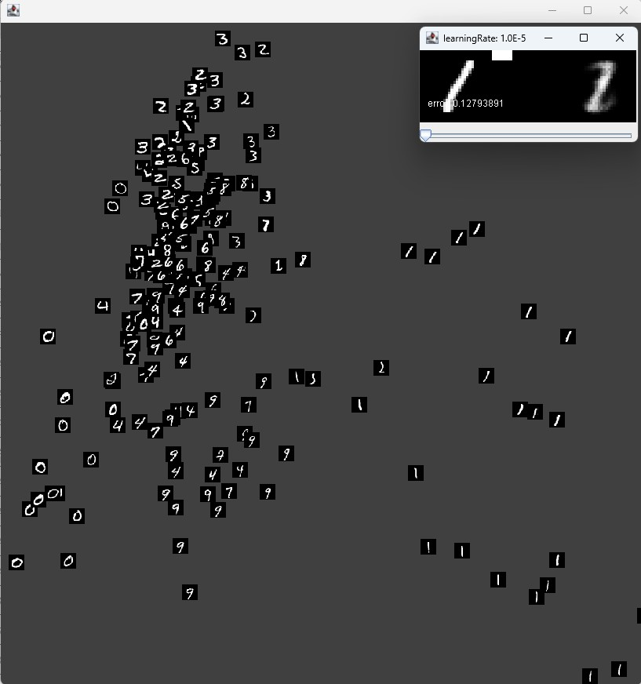

# MultiLayerPerceptron

A project I developed in my free time. The project is about a Neural Network implementation in Java.
I experimented a lot using the public MNIST dataset of handwritten digits.

## History

This project was initially developed as an implementation, based on Daniel Shiffman’s
2017 video series Neural Networks from The Coding Train.
The neural network implementation has been rewritten since which is available under `src/main/java/neuralnetwork`.

## Setup

Clone the project and initialise Gradle.
As git has some issues with versioning the MNIST dataset, the files need to be downloaded seperately
from: https://www.kaggle.com/datasets/hojjatk/mnist-dataset and should be put into `src/main/ressources/mnist`.

## Features

The neural network implementation features:

### Tensor Math Implementation

- **Supported Types:** Scalars, Vectors, Matrices, and 4D Tensors
- **Location:** `src/main/java/neuralnetwork/math`
- **Testing:** Includes unit tests that validate mathematical operations against [NumPy](https://numpy.org/)
- **Test Prerequisites:** A Python environment with NumPy installed globally is required to run the validation suite

### Optimizer Implementations

- **Adam:** `neuralnetwork.optimizer.Adam`
- **Stochastic Gradient Descent:** `neuralnetwork.optimizer.SGD`

## Screenshots

The `src/main/java/models` folder includes some examples on how the neural network can be used.
The subprojects are written with java swing to feature a window and test out the neural networks in real time.
Screenshots of them can be seen here:

### AutoEncoder

A simple implementation of an AutoEncoder which compresses a image from the MNIST dataset into a single floating point
value and then tries to reconstruct it.

### Diffusion

An implementation of a Diffusion image generated, which I implemented intuitively after reading about diffusion models.
The implementation allows you to remove noise and also generate new numbers based on the MNIST dataset.

In this image the Diffusion model generated a new image just based from image noise.

### Classification

A typical digit classification example using a convolutional neural network.

It can correctly detect the self-drawn digit on the left side, which it had never seen doing training.

### Old projects using the old Neural Network implementation

There are still projects using an older version of the neural network implementation available under
`test/java/neuralnetwork/models`.
With projects like:

- Upscaling MNIST dataset images using a AutoEncoder
- Non-working GAN implementations
- And implementation to visualise the bottleneck of an AutoEncoder:

### AutoEncoder Bottleneck

An implementation which provides an implementation of an AutoEncoder featuring a visualization using an AutoEncoder
which maps images onto a 2D grid, illustrating the compression/distribution of data within the model's 2D latent
bottleneck.

